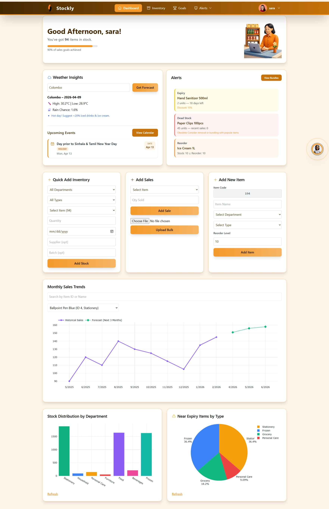
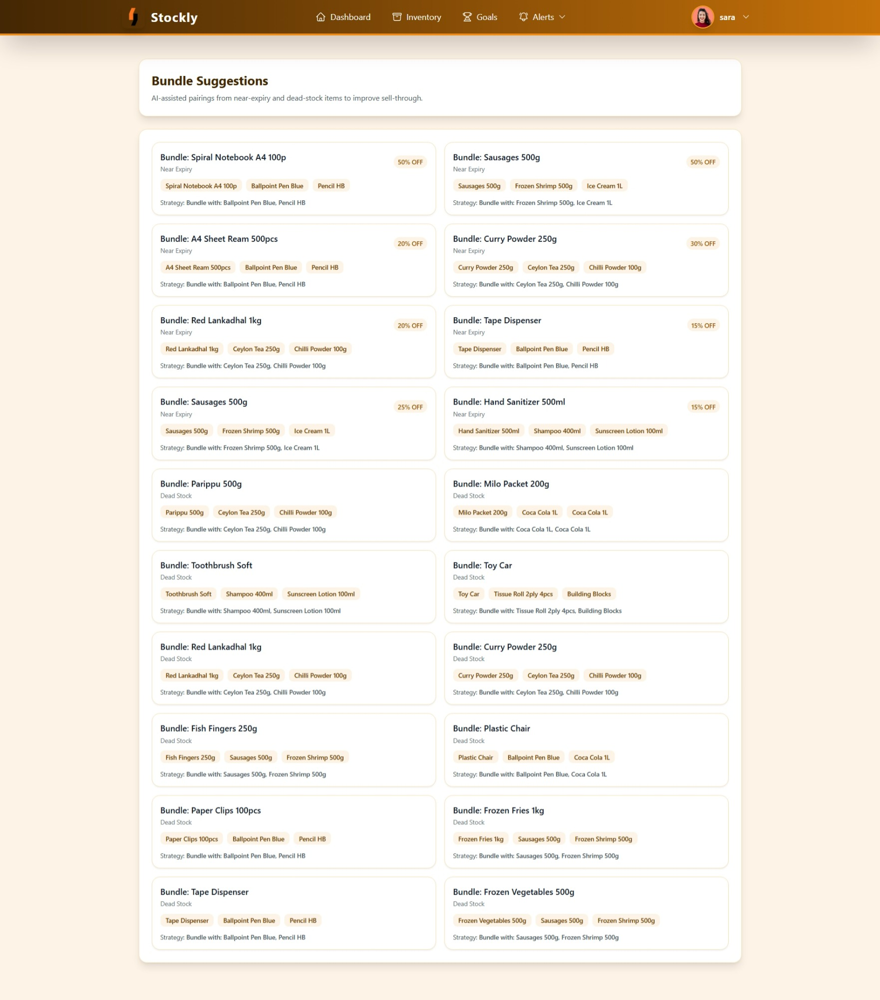
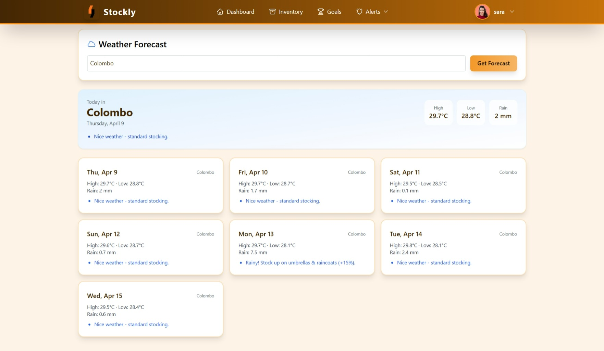
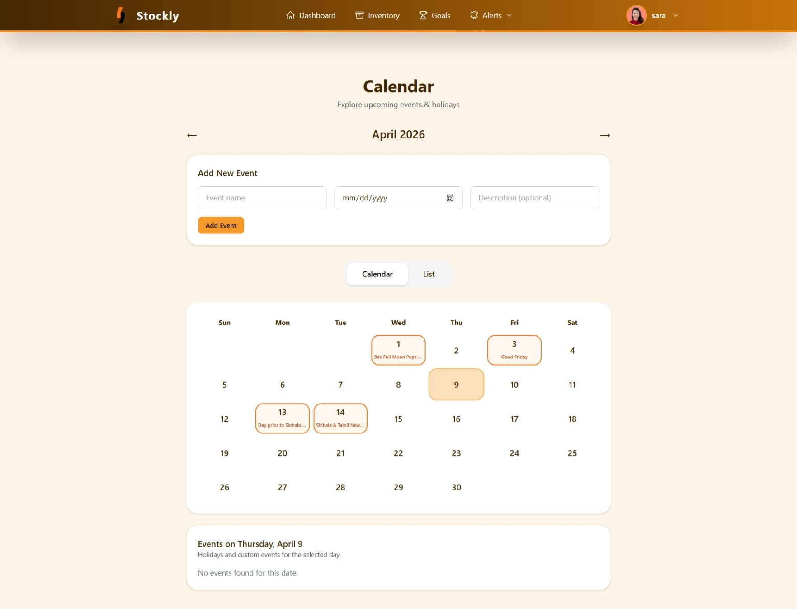
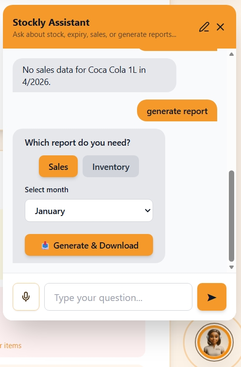

# Stockly

<p align="center">
  
</p>

<p align="center">
  Smart inventory management for stock, sales, alerts, forecasts, and planning.
</p>

<p align="center">
  
  
  
  
</p>

Stockly is a modern inventory management dashboard built with React and Tailwind CSS. It helps businesses monitor inventory, track expiry and restock alerts, manage sales goals, view weather-based insights, and chat with an embedded assistant for quick actions and report generation.

## Highlights

- Inventory dashboard with live summaries and charts
- Searchable, sortable inventory list
- Expiry, restock, dead stock, and bundle suggestion views
- Sales entry, bulk upload, and sales forecasting
- Goal tracking for sales targets
- Calendar for holidays and custom events
- Weather forecast integration
- Chatbot assistant with voice input and report generation
- Role-based login and user management
- Dark mode support

## Screenshots

<table>
  <tr>
    <td width="50%" valign="top" align="center">
      
      <br />
      <sub><strong>Dashboard</strong></sub>
    </td>
    <td width="50%" valign="top" align="center">
      
      <br />
      <sub><strong>Bundle Suggestions</strong></sub>
    </td>
  </tr>
  <tr>
    <td width="50%" valign="top" align="center">
      
      <br />
      <sub><strong>Weather Forecast</strong></sub>
    </td>
    <td width="50%" valign="top" align="center">
      
      <br />
      <sub><strong>Calendar</strong></sub>
    </td>
  </tr>
  <tr>
    <td colspan="2" valign="top" align="center">
      
      <br />
      <sub><strong>Chatbot Assistant</strong></sub>
    </td>
  </tr>
</table>

## Demo Video

- YouTube: `https://youtu.be/your-demo-video`
- GitHub preview: add a linked thumbnail here later

## About This Project

Stockly was built as a final-project style inventory platform to demonstrate CRUD workflows, dashboard analytics, alerting, forecasting, and assistant-driven actions in a single polished interface.

It is designed to feel like a real product rather than a collection of forms, with a strong focus on decision support, visual clarity, and practical business use.

## Features

### Dashboard
- Quick overview of inventory, alerts, goals, weather, and upcoming events
- Sales trend chart and department-wise stock distribution
- Fast access to alerts and actions from a single screen

### Inventory Management
- Full inventory list with search and sorting
- Add new items with auto-generated item codes
- Track quantity, reorder level, expiry date, department, and type

### Smart Alerts
- Expiry alerts for items close to expiration
- Restock alerts for low-stock items
- Dead stock alerts for slow-moving items
- Bundle suggestions to help move related products

### Sales and Forecasting
- Add single sales entries
- Upload bulk sales data through Excel files
- View historical sales trends
- Predict future sales demand
- Predict reorder quantity for products

### Sales Goals
- Create and manage sales goals
- Track progress against targets
- View completion status and deadlines

### Calendar and Events
- Monthly calendar view
- Custom event creation for managers
- Holiday and upcoming event display
- Edit and delete custom events

### Weather Forecasting
- Search weather by city
- View forecast data and stocking suggestions
- Save the latest forecast for quick reference

### Chat Assistant
- Floating chatbot for inventory help
- Ask about stock, sales, alerts, and reports
- Voice input support in compatible browsers
- Generate and download reports from the chat window

### User Management
- Secure login
- Role-based access control
- Create user functionality for managers
- Profile picture upload and settings

## Tech Stack

- React 19
- React Router
- Axios
- Tailwind CSS
- Plotly.js
- React Hot Toast
- Lucide React
- Heroicons

## Showcase Tips

- Keep screenshots consistent in size and crop for a cleaner gallery.
- Add a short demo video after you record the final walkthrough.
- If you later add more screenshots, place them in `src/assets` or a dedicated `docs/screenshots` folder.
- Keep course submission details in a separate file so the public README stays professional.

## Project Structure

```text
stockly/
|-- public/
|-- src/
|   |-- assets/
|   |   |-- dashboard.jpeg
|   |   |-- weather.jpeg
|   |   |-- bundling.jpeg
|   |   |-- calander.jpeg
|   |   `-- chatbot.jpeg
|   |-- components/
|   |   `-- ChatWidget.jsx
|   |-- contexts/
|   |   `-- ExpiryContext.js
|   |-- pages/
|   |   |-- Dashboard.js
|   |   |-- InventoryList.js
|   |   |-- ExpiryAlerts.js
|   |   |-- RestockAlerts.js
|   |   |-- DeadstockAlerts.js
|   |   |-- BundleSuggestions.js
|   |   |-- Goals.js
|   |   |-- Calendar.js
|   |   |-- WeatherForecast.js
|   |   |-- Login.js
|   |   `-- Settings.js
|   |-- App.js
|   `-- index.js
|-- package.json
`-- README.md
```

## Getting Started

### Prerequisites

- Node.js
- npm
- Backend API running at `http://127.0.0.1:5000`

### Install

```bash
git clone https://github.com/your-username/stockly.git
cd stockly
npm install
```

### Run

```bash
npm start
```

Open `http://localhost:3000` in your browser.

### Build

```bash
npm run build
```

## Backend

This repository contains the frontend application.

- Frontend repo: `https://github.com/Rashmi-kavindya/Inventory-management-system`
- Backend repo: `https://github.com/Rashmi-kavindya/stockly-backend`

## Notes

- The app expects the backend API to be available locally during development.
- Some features depend on backend endpoints, including login, alerts, chatbot responses, weather data, and reports.

## Author

Rashmi Kavindya
